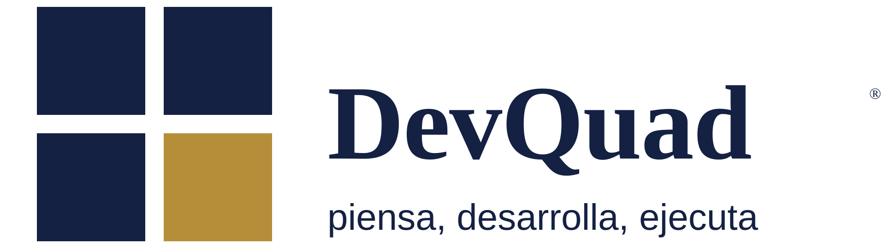

<p align="center">
  
</p>

<p align="center">
  <a href="https://devquad.cl"></a>
  
  <a href="https://sonarcloud.io/summary/new_code?id=LSJ-tech_devquad"></a>
</p>

<p align="center"><i>Piensa, desarrolla, ejecuta.</i></p>

---

Landing page de **DevQuad**, equipo de desarrollo de software. Sitio estático en HTML/CSS/JS puro, sin frameworks ni build step, con modo claro/oscuro, formulario funcional y buenas prácticas de SEO y accesibilidad.

## Equipo

Cuatro amigos de primer año de universidad, cada uno responsable de un área:

| Nombre | Área |
|---|---|
| **Logan Silva** | Frontend |
| **Maximiliano Montoya** | Backend & API |
| **Gianni Antonietti** | Infraestructura & Deploy |
| **Camilo Sepúlveda** | QA & Contenido |

## Estructura

```
devquad/
├── index.html              página principal (Hero, Nosotros, Servicios, Equipo, Contacto)
├── privacidad.html         política de privacidad
├── 404.html                página de error personalizada
├── style.css                estilos, modo claro/oscuro vía [data-theme]
├── script.js                menú móvil, nav activo, modo oscuro, formulario, animaciones
├── fonts/                    Inter y Montserrat auto-hospedadas (.woff2)
├── img/                       favicons, íconos PWA, imagen para compartir (og-image.png)
├── devquad-logo(.svg|-dark.svg)  logo para modo claro y oscuro
├── robots.txt, sitemap.xml, site.webmanifest   SEO y PWA
└── .sonarcloud.properties     configuración de análisis de código
```

## Ejecutar localmente

No requiere instalación. Basta con abrir `index.html` en el navegador, o levantar un servidor estático simple:

```bash
python -m http.server 8000
```

## Formulario de contacto

Envía los mensajes vía [Formspree](https://formspree.io/), con un campo honeypot (`_gotcha`) para filtrar spam.

## Hosting

| | |
|---|---|
| **DNS y proxy** | Cloudflare (dominio `devquad.cl` registrado en NIC Chile) |
| **Hosting** | GitHub Pages, deploy automático al hacer push a `master` |
| **Cabeceras de seguridad** | HSTS, CSP, X-Frame-Options, etc. — configuradas como Transform Rules en Cloudflare, no en este repositorio |
